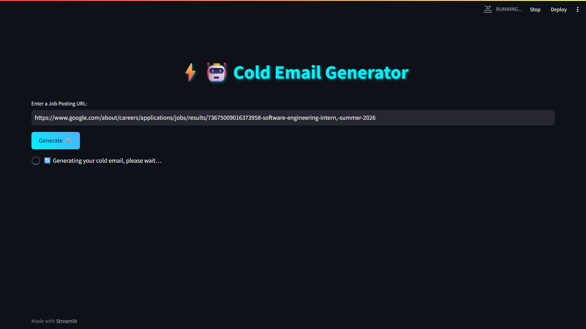
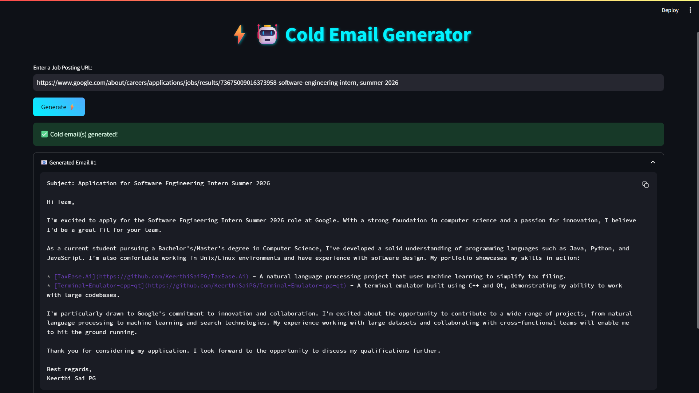

# ⚡🤖 Cold Email Generator


A smart AI-powered tool that extracts job details from any job posting URL and generates personalized cold emails using LLaMA 3 (via Groq) + LangChain + ChromaDB. Built with ❤️ in Streamlit.

---

## 🔥 Features

- ✨ LLM-powered cold email writing using your own resume
- 🌐 Scrape job posting content from any public job link
- 🧠 Matches job description with your portfolio
- ⚙️ Uses `Groq` for ultra-fast inference with `LLaMA 3`
- 🧾 Typing animation with monospace font like a terminal
- 🧠 Semantic matching via `ChromaDB`
- 🎨 Stylish meta-themed UI

---
## Demo


## 📸 Screenshots

 
 

---

## 🛠️ Tech Stack

- **Frontend:** Streamlit
- **LLM:** LLaMA 3 (Groq API)
- **Framework:** LangChain
- **Embedding Store:** ChromaDB
- **Data Loader:** LangChain WebBaseLoader
- **Vector Search:** Semantic match of skills from resume
- **UI:** Custom CSS with copy-to-clipboard + typing animation

---

## Set-up
1. To get started we first need to get an API_KEY from here: https://console.groq.com/keys. Inside `app/.env` update the value of `GROQ_API_KEY` with the API_KEY you created. 


2. To get started, first install the dependencies using:
    ```commandline
     pip install -r requirements.txt
    ```
   
3. Run the streamlit app:
   ```commandline
   streamlit run app/main.py
   ```

